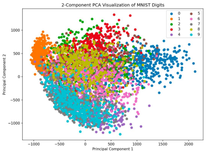

# Disclaimer

\input{../disclaimer.tex}

---

# Paper 1: GANSpace {.plain}

\begin{center}
\includegraphics[width=0.9\columnwidth]{imgs/paper1_title.png}
\end{center}

[@harkonen2020ganspace]

---

# GANSpace: Motivation

- GANs are models trained to generate realistic-looking images well—and they do!
- They have not been designed, however, to make the image-generation process
itself interpretable, or to support edits to generated images
- E.g.: This GAN generates faces well and can take in high-level styles or criteria
(gender, age, race), but is not designed to facilitate post-hoc continuous and
meaningful edits, such as head angle, hair length, lighting...

\vspace{1em}
\begin{center}
\includegraphics[width=0.85\columnwidth]{imgs/ganspace_motivation.png}
\end{center}


---

# Main Contributions

- Applying a simple technique (**PCA**) in the latent space of GANs gives
semantically significant directions.
- Perturbing inputs in these directions in certain layers of the GANs $\rightarrow$
interpretable edits in properties of generated images.
- Such edits are high-level and nuanced (e.g. object shape to background
landscape)
- A user need only label each “control direction” once to edit the image

## In plain english

In other words, the authors posit that exploring the “EiGANspace” gives us new controls to edit and possibly better understand GANs at low cost

---

# Main contributions example

\vspace{1em}
\begin{center}
\includegraphics[width=0.85\columnwidth]{imgs/contributions_example}
\end{center}


---

# Background: Generative Adversarial Networks

\begin{center}
Seminal Paper: \textbf{Goodfellow et al. (2014)}
\end{center}

- **Objective:** Generative Image Modeling—create realistic-looking, artificial
images that resemble the training data.
- **GAN** = Generator (G) + Discriminator (D) networks, both CNNs in image
context.
    - **Generator** $G$: maps latent $\mathbf{z}$ to image $G(\mathbf{z})$
    - **Discriminator** $D$: distinguishes real vs. generated images

\vspace{1em}
\begin{center}
\includegraphics[width=0.5\columnwidth]{imgs/gan_background.png}
\end{center}


---

# Background: BigGAN ---

**BigGAN** (Brock et al., ICLR 2019): class-conditional GAN for high-resolution image synthesis.

- **Class-Conditional Generation:** given $\mathbf{z}$ and a class label (e.g., "dog"), models $p(\mathbf{x} \mid \text{class})$ — the generated image depends on both the latent code and the class.
- **Skip-Z Inputs:** $\mathbf{z}$ is injected as a shared embedding into *every* intermediate layer:

\begin{center}
$\mathbf{y}_i = G_i(\mathbf{y}_{i-1},\ \mathbf{z})$, where $\mathbf{y}_i$ is the feature tensor at layer $i$.
\end{center}


## In plain English

Unlike a basic GAN where $\mathbf{z}$ only enters at the start, BigGAN re-injects it at every layer: the model "remembers" the original seed while building the image step by step, allowing $\mathbf{z}$ to influence features at every level of abstraction.

---

# Background: BigGAN — Latent Space Control ---

BigGAN generates images from two inputs that control different aspects of the output:

- **Class label $c$:** *what* to generate (e.g., "dog", "cat")
- **Latent vector $\mathbf{z} \sim \mathcal{N}(0, I)$:** *which specific instance* — pose, lighting, background, but **no dimension has a predefined meaning**; the structure is learned implicitly during training.
  

```python
image1 = G(z1, "dog")   # a golden retriever sitting
image2 = G(z2, "dog")   # a husky running
```

Same $\mathbf{z}$, different class → analogous instance of a different subject:

```python
image3 = G(z1, "cat")   # a cat with attributes "analogous" to z1
```

\begin{center}
\includegraphics[width=0.4\columnwidth]{imgs/biggan_background.png}
\end{center}


---

# Background: StyleGAN 1/2

StyleGAN (Karras et al., CVPR 2019): style-based generator inspired by style transfer — separating content from appearance.

\begin{center}
\includegraphics[width=0.65\columnwidth]{imgs/stylegan_background.png}
\end{center}

---

# Background: StyleGAN  2/2

- **Motivation:** gain fine-grained control over the image synthesis process at different levels of abstraction (pose, lighting, texture, fine details).
- **Key idea:** instead of feeding $\mathbf{z}$ directly, map it to a style vector $\mathbf{w}$ that controls synthesis at each layer via AdaIN:

$$\mathbf{w} = M(\mathbf{z}), \qquad \mathbf{y}_i = G_i(\mathbf{y}_{i-1},\ \mathbf{w})$$

- **$\mathbf{w}$-space** is more disentangled than $\mathbf{z}$-space — a better place to look for interpretable directions.


---

# Background: PCA

:::: columns
::: {.column width="60%"}
1. **What is it?**

- An unsupervised learning technique for finding a lower-dimensional representation of a dataset
- Find axes that explain the most variance in the data
- Principal Components are these axes: they equal the eigenvectors corresponding to the largest eigenvalues of the covariance matrix

2. **Why is it useful in our context?**

  - Each PCA basis vector helps better
    separate our data, or, in this context,
    latent space representation vectors
:::
::: {.column width="38%"}



:::
::::


---

# Related Work 

- **Supervised latent directions** (Jahanian et al., Goetschalckx et al.): useful but require manual labeling of training images — expensive and hard to scale.

- **GANs with disentangled representations** (Ramesh et al.): would allow fine-grained edits, but retraining from scratch is extremely computationally expensive.

**So, why not take an already-trained GAN and analyze its latent space directly?**

---

# Finding Useful Directions in Latent Space ---

We want directions in latent space that correspond to meaningful changes in pixel space — e.g., a direction that smoothly varies hair color while leaving everything else unchanged.

**Idea:** use PCA to find the most influential directions.

**Issue:** where to run PCA?

- **$\mathbf{z}$-space prior:** isotropic by construction — all directions equally likely, no structure to exploit.
- **Pixel space:** too high-dimensional and complex to yield interpretable directions.

## In plain English

We need a space that is neither too raw nor too complex — somewhere in between where the GAN has already organized semantic information. That is exactly what the intermediate feature space of the network provides.

---

# Methods: StyleGAN Approach 1/2

**Idea**: PCA directly on $\mathbf{w}$-space samples

$$\mathbf{w} = M(\mathbf{z}), \qquad \mathbf{y}_i = G_i(\mathbf{y}_{i-1},\ \mathbf{w})$$

- $\mathbf{z}$ is a raw random seed — 512 numbers with no explicit semantic structure. 
- The mapping network $M$ transforms it into $\mathbf{w}$, a vector where semantic attributes are more linearly separated.
-  Think of it as converting from polar to Cartesian coordinates: same information, but in a coordinate system where it is easier to move in one direction without affecting the others. 
- That is why GANSpace applies PCA directly in $\mathbf{w}$-space rather than $\mathbf{z}$-space for StyleGAN.


---

# Methods: StyleGAN Approach 2/2

**Idea**: PCA directly on $\mathbf{w}$-space samples

1. Sample $N$ random $\mathbf{z}_{1:N}$, pass through mapping network to get $\mathbf{w}_{1:N}$
2. Apply PCA to $\mathbf{w}_{1:N}$ → basis $\mathbf{V}$, mean $\boldsymbol{\mu}$
3. Represent each $\mathbf{w}$ in new basis: $\mathbf{x} = \mathbf{V}^T(\mathbf{w} - \boldsymbol{\mu})$

## Editing
Move in the $k$-th principal direction with magnitude $\alpha$:
$$\mathbf{w}' = \mathbf{w} + \alpha \mathbf{v}_k$$
Apply $\mathbf{w}'$ to some or all synthesis layers for global vs. localized edits.

---

# Methods: BigGAN Approach 1/2

**Idea:** since BigGAN has no separate $\mathbf{w}$, run PCA at the first linear layer and transfer the principal directions back to $\mathbf{z}$-space.

**Step 1 — PCA in feature space:**

1. Sample $N$ random vectors $\mathbf{z}_{1:N}$
2. Process through model to get feature tensors $\mathbf{y}_{1:N}$ at layer $i$
3. Apply PCA to $\mathbf{y}_{1:N}$ → basis $\mathbf{V}$, mean $\boldsymbol{\mu}$
4. Project: $\mathbf{x}_{1:N} = \mathbf{V}^T(\mathbf{y}_{1:N} - \boldsymbol{\mu})$

**Step 2 — Transfer to latent space:**

$$\mathbf{U} = \underset{\mathbf{U}}{\arg\min} \sum_j \|\mathbf{U}\mathbf{x}_j - \mathbf{z}_j\|^2$$

- Editing then follows the same form as StyleGAN: $$\mathbf{z}' = \mathbf{z} + \mathbf{U}\mathbf{x}$

---

# Methos BigGAN as Code

\fontsize{10pt}{9pt}
:::: columns
::: column
```python

# 1. Load pretrained BigGAN (frozen)
model = BigGAN.from_pretrained(
  "biggan-deep-512").eval()

# 2. Sample latent vectors 
# and extract features
Z = torch.randn(10000, 128)
Y = model.first_linear_layer(Z)
Y = Y.detach().numpy()

# 3. PCA on features
pca = PCA(n_components=50).fit(Y)
X = pca.transform(Y) # (10000, 50)
V = pca.components_ # (50, d)
```
:::
::: column
```python
# 4. Regression: 
#   find directions in z-space
reg = LinearRegression().fit(
  X, Z.numpy())
U = reg.coef_ # (50, 128)

# 5. Edit an image
z = torch.randn(1, 128)
class_label = one_hot(
  "dog", num_classes=1000)

k = 3 # direction (named manually)
alpha = 2.0 # magnitude of edit

z_edit = z + alpha * torch.tensor(U[k])
image  = model(z_edit, class_label)
```
:::
::::


---

# Methods: Granularity of Edits

:::: columns
::: {.column width="50%"}
**Layerwise control**

- **StyleGAN**: pass modified $\mathbf{w}'$ to some layers, original $\mathbf{w}$ to others
- **BigGAN**: pass modified $\mathbf{z}'$ to some layers + keep original $\mathbf{z}$ at start of network
:::
::: {.column width="50%"}
**Composed edits**

- Edits can be *composed* by moving in **several** principal directions simultaneously
- Directions can be **labelled** by users to correspond to semantic concepts
:::
::::

---

# Findings and Results

\begin{center}
\includegraphics[width=0.85\columnwidth]{imgs/ganspace_cats_grid.png}
\end{center}

## Key Finding 1
Changing the \textbf{first 20} PCs in latent space corresponds to changes in image \textbf{layout}, \textbf{configuration}, and \textbf{perspective}; later PCs dictate object appearance, background, and smaller details.

---

# Findings and Results

\begin{center}
\includegraphics[width=0.75\columnwidth]{imgs/ganspace_variance_pdf.png}
\end{center}

## Key Finding 2
StyleGAN's \textbf{first 100 PCs sufficiently explain overall image} appearance, and are distributed unimodally and almost independently.


---

# Findings and Results

\begin{center}
\includegraphics[width=0.8\columnwidth]{imgs/ganspace_class_independent.png}
\end{center}


## Key Finding 3
BigGAN's PCs seem to be \textbf{class-independent}: PCA gives the same results for different images in different classes.

---

# Analyzing GANs Through Principal Components

:::: columns
::: {.column width="48%"}
**Limitations** (inherited from dataset)

- StyleGAN faces cannot be translated in the image
- PCs for wrinkles/makeup have no effect on children/men

:::
::: {.column width="48%"}
**Entanglement/Superposition**

- One PC for StyleGAN cars corresponds to sportiness *and* open-road backgrounds
- Rotating a dog causes its mouth to open

:::
::::

\begin{center}
\includegraphics[width=\columnwidth]{imgs/ganspace_entanglement.png}
\end{center}


---

# Comparison with Related Techniques

**vs. random directions:** moving $\mathbf{z}$ in a random direction produces mixed, uninterpretable changes — multiple attributes shift at once with no clear order. PCs, by contrast, are ranked by variance and tend to separate attributes. Images (a)(b)(c)(d) demonstrate this: fixing the first 5 PCs freezes the car's pose, while fixing 5 random directions freezes nothing meaningful.

**vs. supervised methods:** GANSpace achieves similar results — e.g., the smile edit on the right — with no extra training or labels. The downside is slightly more entanglement: making someone smile may also subtly shift the head or background. Supervised methods are more precise but require a pretrained classifier for each attribute.

\begin{center}
\includegraphics[width=0.75\columnwidth]{imgs/ganspace_comparison.png}
\end{center}


---

# Strengths / Weaknesses

:::: columns
::: {.column width="50%"}
\textcolor{primarygreen}{\textbf{Strengths}}

- Unsupervised and computationally simpler than supervised methods
- PC directions elucidate interpretable GAN latent representations
- After labelling directions, users can perform numerous edits on various styles
:::
::: {.column width="50%"}
\textcolor{red}{\textbf{Weaknesses}}

- Approach limited to specific GAN architectures
- PCs are not *a priori* linked to semantic meaning
- Choice of which PCs to modify at which layers seems arbitrary
- Entanglement of PC styles hinders practicality
- Does this constitute actual **interpretability** for GANs?
:::
::::

---

# GANSpace: Discussion Questions

- Are these principal components a useful tool for **interpreting** GANs?
- How does their utility compare with other interpretability methods we've studied?
- Most conceptually-aligned PCs for StyleGAN are in $\mathbf{w}$-space; most useful PCs for BigGAN originate in the first linear layer (then projected to $\mathbf{z}$-space)
- Do these findings provide novel insights into the models?
- How could this tool help **identify and reduce biases** in a model?

---

# GANSpace: Summary

Experiment targets: **StyleGAN**, **BigGAN** (methods differed for the models)

1. Changing the **first 20** PCs corresponds to changes in image **layout**, **configuration**, and **perspective**; later PCs dictate appearance and details
2. StyleGAN's **first 100 PCs** sufficiently explain overall image appearance, distributed unimodally and almost independently
3. BigGAN's PCs seem to be **class-independent**

[@harkonen2020ganspace]

---

# Paper 2: InterFaceGAN {.plain}

\begin{center}
\includegraphics[width=0.75\columnwidth]{imgs/paper2_title.png}
\end{center}

[@shen2020interfacegan]


---

# Background: What are GANs?

- **GAN**: generative models that generate realistic synthetic data mimicking training data
  - **Generator**: generates samples similar to training data
  - **Discriminator**: distinguishes generated (fake) from real samples
- **Latent representation**: a low-dimensional representation of an image
- **Latent space**: the set of all possible latent representations
  - Through adversarial training, the generator learns a mapping from latent space to real images

\begin{center}
\includegraphics[width=0.6\columnwidth]{imgs/gan_diagram.png}
\end{center}

---

# Background: GANs for Image Editing

- **Latent code**: the version of an image in the latent space
  - **GAN inversion**: identifying the latent code for a given image such that the generator could reconstruct it
- **Semantic editing**: editing the latent code to manipulate some features of the resulting image, such that only the desired features are changed

:::: columns
::: {.column}

\begin{center}
\includegraphics[width=\columnwidth]{imgs/latent_code_editing.png}
\end{center}

:::
::: {.column}

## In plain English

Instead of editing pixels directly, we edit the latent code — a much lower-dimensional space. Change one coordinate in the right direction and the face ages; change another and it smiles. The challenge is finding those directions, which is exactly what InterFaceGAN addresses.

:::
::::

---

# Related Work

- **Exploring latent spaces in GANs**
  - Laine et al.: smoothly varying outputs across latent space
  - Radford et al. observe the *vector arithmetic property*:
    `vector("King") - vector("Man") + vector("Woman") = vector("Queen")`
  - Applications in camera motion, scene synthesis, memorability

\vfill

- **Semantic face editing with GANs**
  - Previous methods required carefully designed loss functions or specialized architectures
  - No existing method to perform controlled facial editing by varying latent codes

---

# Research Questions

- **How do semantics in the latent space originate, and how are they organized?**
  - Does there exist structure in the latent space relating to disentangled semantic representations?

\vfill

- **What does a GAN actually learn with respect to the latent space?**
  - How does the GAN connect the latent space and the image semantic space?

\vfill

- **How can the latent code be used for image editing?**
  - How are various semantic attributes of an individual's face (gender, age) determined and entangled?

---

# Contributions and Main Findings

- Proposed **InterFaceGAN**, a framework to identify semantics encoded in the latent space of face synthesis models
  - GANs learn **latent subspaces** corresponding to specific attributes

\vfill

- InterFaceGAN enables **semantic face editing with any pre-trained GAN**
  - Found theoretical and experimental results verifying that linear subspaces align with emerging semantics

\vfill

- Applied InterFaceGAN to **real image editing**
  - Successfully edited attributes of real faces by varying the latent code

---

# Method: Semantic Subspace

The core assumption: for any binary attribute (e.g., male/female), there exists a hyperplane in latent space that separates the two classes. The signed distance from that hyperplane predicts the attribute score:

$$d(\mathbf{n}, \mathbf{z}) = \mathbf{n}^T\mathbf{z}$$

## Key Hypothesis

The semantic score of a generated image is linearly proportional to the distance from the hyperplane:

$$f(g(\mathbf{z})) = \lambda \, d(\mathbf{n}, \mathbf{z})$$

where $f$ scores the attribute and $\lambda > 0$. The hyperplane $\mathbf{n}^T\mathbf{z} = 0$ divides latent space into two semantic regions. In practice, $\mathbf{n}$ is found by training a **linear SVM** on labeled latent codes.


---

# Method: Semantic Subspace 

Think of the latent space as a room divided by an invisible wall — on one side are "young" faces, on the other "old" faces. Moving $\mathbf{z}$ perpendicularly across that wall ages the person. InterFaceGAN finds where that wall is.

\vfill

\begin{center}
\includegraphics[width=0.4\columnwidth]{imgs/smile.png}
\end{center}

---

# Method: Conditional Manipulation

To edit attribute $A_1$ while **preserving** attribute $A_2$, project out the component of $\mathbf{n}_1$ along $\mathbf{n}_2$:

$$\mathbf{n}_1^* = \mathbf{n}_1 - (\mathbf{n}_1^T \mathbf{n}_2)\mathbf{n}_2$$

\begin{center}
\includegraphics[width=0.5\columnwidth]{imgs/interfacegan_subspace_projection.png}
\end{center}


Move along $\mathbf{n}_1^*$ to change $A_1$ while remaining on the hyperplane of $A_2$.

---

# Experiment 1: Latent Space Separation

- **Model** - PGGAN (for experiment 2 and 3 also)
  - trained by growing both the generator and discriminator progressively: starting from a low
    resolution, add new layers that model increasingly fine details as training progresses.
  - Trained on CelebA-HQ face attributes dataset (each face is labeled with a subset of 40
    attribute annotations). 30,000 images in total.

\begin{center}
\includegraphics[width=0.6\columnwidth]{imgs/pggan_architecture.png}
\end{center}

Train 5 independent linear SVMs on pose, smile, age, gender, eyeglasses. Evaluate on validation set (6K samples) and full set (480K samples).


---

# Experiment 1: Hyperplane Assumption

The SVM takes latent codes $\mathbf{z}$ as inputs and **CelebA-HQ** attribute labels as targets. The process is:

1. Sample $N$ random vectors $\mathbf{z}_{1:N}$
2. Generate the corresponding images $G(\mathbf{z}_{1:N})$
3. Use a pretrained attribute classifier (e.g., a "young/old" classifier) to label each generated image
4. Train the SVM on pairs $(\mathbf{z}_i, \text{label}_i)$

- **The SVM never sees pixel**, it learns is a linear boundary in $\mathbb{R}^{512}$ that separates the $\mathbf{z}$'s that generate young faces from those that generate old faces.

- **The key point** is that the attribute classifier converts a question about pixels ("is this face young?") into a label that can be used to supervise the SVM in $\mathbf{z}$-space.

---

# Experiment 1: Classification Accuracy

\begin{center}
\includegraphics[width=0.75\columnwidth]{imgs/interfacegan_separation_table.png}
\end{center}

High accuracy on validation set (95.6–100%) confirms that **linear hyperplanes successfully separate semantic attributes** in latent space.

---

# Experiment 1: Latent Space Visualization

Choose $\mathbf{z}$ far away from and on the decision boundary, then generate from it.

\begin{center}
\includegraphics[width=0.7\columnwidth]{imgs/interfacegan_separation_viz.png}
\end{center}

---

# Experiment 2: Single Attribute Manipulation

Verify whether the semantics found by InterFaceGAN are manipulable.

:::: columns
::: {.column width="30%"}

- **Single attribute** Generate central image then move away from boundary
- Works in both positive and negative directions.

:::
::: {.column width="69%"}

\begin{center}
\includegraphics[width=\columnwidth]{imgs/interfacegan_single_attr.png}
\end{center}

:::
:::::


---

# Experiment 2: Distance Effect

\begin{center}
\includegraphics[width=0.9\columnwidth]{imgs/interfacegan_distance_effect.png}
\end{center}

- Samples suffer severe appearance changes when moved **too far** from the boundary 
- extreme samples are **unlikely to be drawn** from a standard normal distribution.

---

# Experiment 2: Artifacts Correction

\begin{center}
\includegraphics[width=.5\columnwidth]{imgs/interfacegan_artifacts.png}
\end{center}


Manually labelled 4K bad syntheses (with artifacts), trained a linear SVM to find the separation hyperplane, then moved along the "quality" direction to fix them.


---

# Experiment 3: Conditional Manipulation

Study the disentanglement between different attributes.

\begin{center}
\includegraphics[width=\columnwidth]{imgs/interfacegan_correlation_tables.png}
\end{center}

Attribute correlations (age$\leftrightarrow$gender, age$\leftrightarrow$eyeglasses) reflect those in the training dataset — male older people are more likely to wear eyeglasses.

---

# Experiment 3: Conditional Manipulation Results

\begin{center}
\includegraphics[width=0.60\columnwidth]{imgs/interfacegan_conditional_results.png}
\end{center}

- Conditional manipulation preserves the untargeted attribute while editing the targeted one.
- To add glasses while preserving age and gender, move along the projected direction — removing the components of $\mathbf{n}_{\text{glasses}}$ that point toward age and gender:

$$\mathbf{n}^* = \mathbf{n}_{\text{glasses}} - (\mathbf{n}_{\text{glasses}}^T \mathbf{n}_{\text{age}})\mathbf{n}_{\text{age}} - (\mathbf{n}_{\text{glasses}}^T \mathbf{n}_{\text{gender}})\mathbf{n}_{\text{gender}}$$

---

# Experiment 4: Results on StyleGAN

**StyleGAN** extends PGGAN with four key changes:

:::: columns
::: {.column width="45%"}

- **Mapping Network:** transforms $\mathbf{z}$ into $\mathbf{w}$ via 8 FC layers — a more disentangled space.
- **Synthesis Network + AdaIN:** $\mathbf{w}$ controls each layer's style separately via adaptive normalization.
- **Bilinear Sampling:** smoother upsampling than nearest-neighbor.
- **Mixing Regularization:** uses two latent codes $\mathbf{w}_1, \mathbf{w}_2$ at different layers, forcing separation between coarse (pose, identity) and fine (texture, color) attributes.

:::
::: {.column width="55%"}

\begin{center}
\includegraphics[width=\columnwidth]{imgs/stylegan_architecture.png}
\end{center}

:::
::::

---

# Experiment 4: W-Space vs Z-Space

\begin{center}
\includegraphics[width=0.85\columnwidth]{imgs/interfacegan_stylegan_results.png}
\end{center}

- **W-space** learns a more disentangled representation
- **W-space** performs better in long-distance manipulation
- **W-space** better captures attribute correlations

---

# Experiment 5: Real Image Manipulation

Take a real face image → invert to latent code → use InterFaceGAN to edit.

**Latent Code Optimization**
Optimize latent code with fixed generator to minimize pixel-wise reconstruction error.

\begin{center}
\includegraphics[width=0.75\columnwidth]{imgs/interfacegan_real_image.png}
\end{center}

 **(a)** PGGAN with optimization-based inversion method, **(b)** PGGAN with encoder-based inversion
method, **(c)** StyleGAN with optimization-based inversion method. 


---

# InterFaceGAN: Discussion Questions

1. Do you believe the use of GANs for generating photo-realistic images should be **regulated**? (Potential misuse)
2. Why do we think there are such simple linear boundaries separating binary semantics in the latent space (is it only for face GANs)?
3. How can analyzing semantic representations be used to **detect biases** in the training data?
4. Have you ever used GANs for photo generation, if so how realistic did you find them?
5. How relevant is this paper given that **GANs are progressively going out of style** (diffusion taking over)?

---

\begin{center}
\Huge Thank You!
\end{center}

---

# References {.allowframebreaks}

\footnotesize
